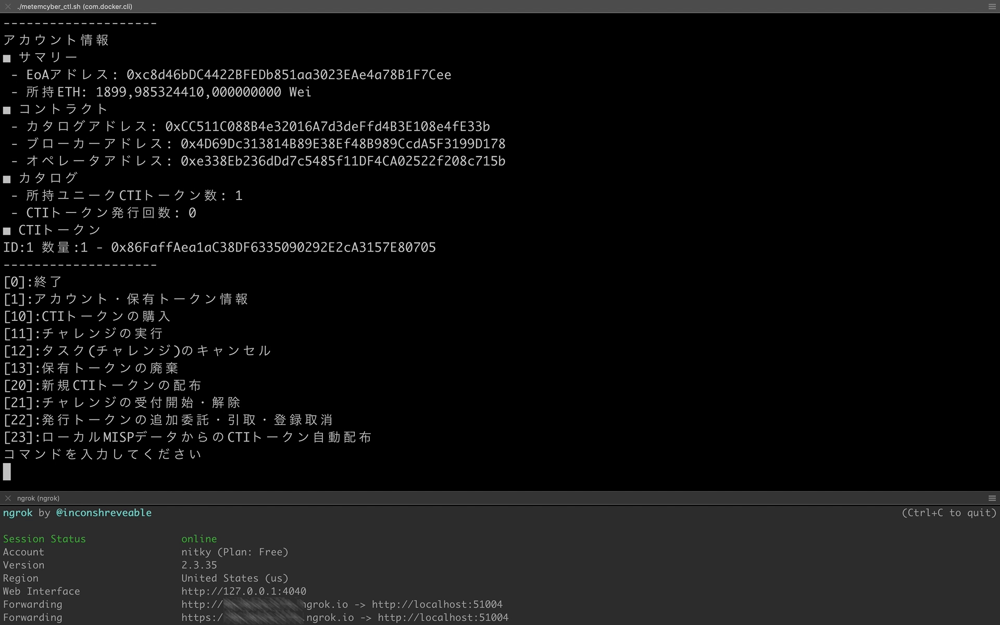

[](https://metemcyber.readthedocs.io/ja/latest/?badge=latest)

# Metemcyber

Decentralized Cyber Threat Intelligence Kaizen Framework.

[Metemcyber User Documentation](https://docs.google.com/document/d/1RL_0hDulTSuogskajhyv--eHGTsOiO6g2WLE4nTned4/edit?usp=sharing)



## [実証実験の参加はこちらから](https://forms.office.com/Pages/ResponsePage.aspx?id=Mu8pprpnpkeOs-xDk1ZE_FdfnH75qvpDtqTkNo9NCzRUN1hRM1lIVVZCTUU3V1VJVjhFWEtQSDFMNy4u)

現在開催中の[実証実験](https://www.ntt.com/about-us/press-releases/news/article/2020/1006_2.html)へのご参加には、[こちらのフォーム](https://forms.office.com/Pages/ResponsePage.aspx?id=Mu8pprpnpkeOs-xDk1ZE_FdfnH75qvpDtqTkNo9NCzRUN1hRM1lIVVZCTUU3V1VJVjhFWEtQSDFMNy4u)から利用規約に同意していただく必要があります。

利用規約に同意していただくことで、以下の情報へのアクセスが可能となります。

 - アクセストークン
 - Metemcyber コミュニティ(Slack ワークスペース)への参加

ご利用のユーザアカウントへの入金は、該当ワークスペースの`#okawari`チャンネルをご利用ください。

## Overview

Metemcyberでは、Cyber Threat Intelligence の共有 (売買) を通じて以下の特徴を実現します。

- インテリジェンスに基づく活動の影響を一か所に集約
- セキュリティ対応に関する気づきを共有
- よりActionableな脅威インテリジェンスの生産

```
git clone --recursive https://github.com/nttcom/metemcyber
cd metemcyber
geth account new
./metemcyber_ctl.sh pricom init 
./metemcyber_ctl.sh - client -f $YOUR_KEY_FILE -w $WEBHOOK_URL
```

## Requirement

Ubuntu 18.04, 20.04, macOS Catalina で動作を確認しています。

- Docker環境 (Docker-CE等)

## Install

Docker環境をセットアップします。

https://docs.docker.com/install/linux/docker-ce/ubuntu/


次に、ユーザーをdockerグループに所属させます。ユーザがdockerグループに所属したことを `id` コマンドで確認してください。

```
sudo usermod -aG docker $USER
su - $USER
id
```

必要なパッケージをインストールします。
```
sudo add-apt-repository -y ppa:ethereum/ethereum
sudo apt-get update
sudo apt install ethereum jq curl python3-dateutil
```

リポジトリをクローンして、metemcyberのフォルダに移動します。
```
git clone --recursive https://github.com/nttcom/metemcyber.git
cd metemcyber
```

## QuickStart

NTTコミュニケーションズのEnterprise Ethereum "Pricom" へ接続します。

### Metemcyberのセットアップ

Ethereum上で利用する鍵ファイルを作成します
```
geth account new
```

Metemcyber実行環境を初期化します。
```
./metemcyber_ctl.sh pricom init
```

P2P接続にngrokを用いるため、以下サイトにてアカウント作成を実施します。

https://dashboard.ngrok.com/

その後、setupページに従ってngrokをセットアップします。

https://dashboard.ngrok.com/get-started/setup


### Metemcyberの起動

**別画面**でngrokを起動し、インターネット上からのデータ接続を可能にします。
```
./ngrok http 51004
```

ngrokが起動されていることを確認し、Metemcyberのクライアントを起動します。
このとき、先ほど作成した鍵ファイルと、ngrok画面で表示されている通信先を指定してください。

デフォルトの場合、作成された鍵ファイルは`~/.etherium/keystore/`配下（Ubuntu環境）または`~/Library/Ethereum/keystore/`配下（macOS環境）にファイル名`UTC--xxxx`の形式で保存されています。

```
./metemcyber_ctl.sh - client -f $YOUR_KEY_FILE -w $YOUR_NGROK_URL
```

**🎉🎉🎉Metemcyberへようこそ！🎉🎉🎉**

CTIの収集や配布に関する詳細な操作は、[Metemcyber User Documentation](https://docs.google.com/document/d/1RL_0hDulTSuogskajhyv--eHGTsOiO6g2WLE4nTned4/edit?usp=sharing) をご覧ください。

### Metemcyberの終了
メニュー画面で 0 を入力するか、Ctrl-C を入力します。

Ctrl-Dを入力すると、いつでもメニュー画面に戻ることができます。

